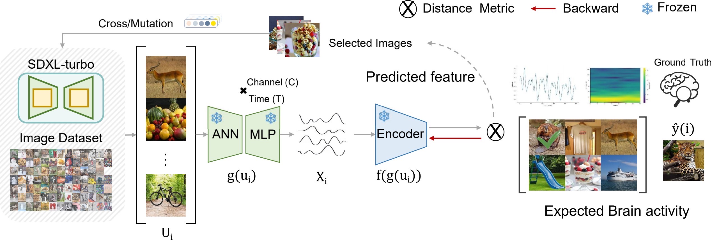

<div align="center">

<h2 style="border-bottom: 1px solid lightgray;">A closed-loop EEG-based visual stimulation framework from controllable generation</h2>


</div>

<br/>

</div>

<!--  -->
  

The closed-loop Framework.


<!-- ## Environment setup -->
<h2 style="border-bottom: 1px solid lightgray; margin-bottom: 5px;">Environment setup</h2>


You can  create a new conda environment and install the required dependencies by running
```
conda env create -f environment.yml
conda activate BCI

pip install wandb
pip install einops
```

<!-- ## Data availability -->
<h2 style="border-bottom: 1px solid lightgray; margin-bottom: 5px;">Data availability</h2>

We provide you with the ``preprocessed EEG`` data used in our paper at [Hugging Face](https://huggingface.co/datasets/LidongYang/EEG_Image_decode), as well as the raw image data.


You can also download the relevant THINGS-EEG data set and THINGS-MEG data set at osf.io.

The raw and preprocessed EEG dataset, the training and test images are available on [osf](https://osf.io/3jk45/).
- ``Raw EEG data:`` `../project_directory/eeg_dataset/raw_data/`.
- ``Preprocessed EEG data:`` `../project_directory/eeg_dataset/preprocessed_data/`.
- ``Training and test images:`` `../project_directory/image_set/`.


<!-- ## Code description -->
<h2 style="border-bottom: 1px solid lightgray; margin-bottom: 5px;">Code description</h2>

* **EEG-preprocessing:** preprocess the raw EEG data.
* **EEG-encoding:** synthesize the EEG responses to images through end-to-end encoding models.
* **EEG-feature:**  Maximize the elicitation of neural activities such as image retrieval and stimulus generation


